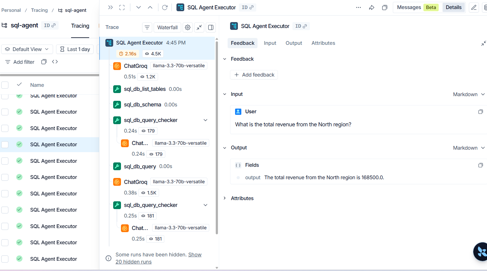
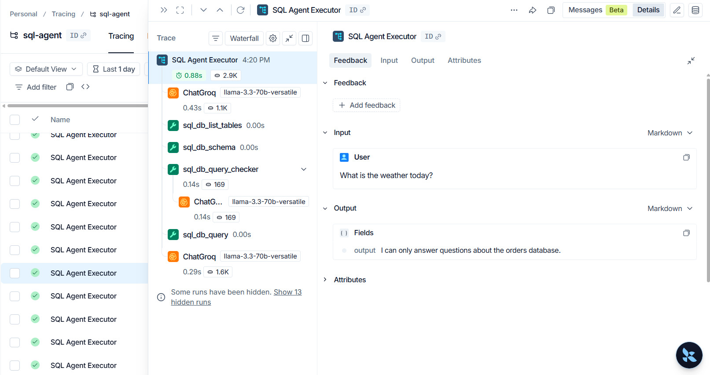
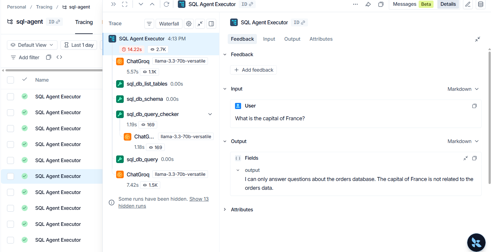

# NL-to-SQL Agent

A conversational agent that turns plain-English questions (e.g. *"what were total sales in March?"*) into validated SQL queries against a real SQLite database, returning grounded answers instead of hallucinated numbers.

## Problem definition

- **Input:** a natural language question about order/sales data, sent as JSON to an HTTP endpoint.
- **Output:** a grounded answer derived from actual SQL execution against the `orders` database — not the LLM guessing a number.
- **Constraints:**
  - Read-only: the agent may only run `SELECT` statements (enforced at the toolkit level).
  - Questions that can't be answered from the schema (e.g. *"what's the weather today?"*) must be refused gracefully — no hallucination, no crash.
  - Deterministic SQL generation: `temperature=0`.
- **Non-goals (v1):** multi-turn memory, write operations (INSERT/UPDATE/DELETE).

## Architecture

```
User question (HTTP POST)
        ↓
FastAPI /query endpoint (Pydantic validates input)
        ↓
LangChain SQL Agent
    ├── Toolkit: list tables, get schema, query DB, check query
    ├── LLM: reasons about which SQL to generate
    └── LangSmith: traces every step above
        ↓
SQLite database (orders.db)
        ↓
Agent formats result → returned as JSON
```

## Tech stack

| Layer | Tool |
|---|---|
| Language | Python 3.11 |
| Agent framework | `langchain`, `langchain-community` |
| LLM | Groq (`llama-3.3-70b-versatile`) |
| Observability | LangSmith |
| Database | SQLite |
| API layer | FastAPI + Pydantic |
| Containerization | Docker |
| Cloud | GCP Cloud Run |

## Safety: read-only by construction

Two independent layers prevent the agent from modifying data:

1. **Toolkit level** — the query tool is a `ReadOnlyQuerySQLTool` that rejects anything that isn't a `SELECT`/CTE (keyword blocklist + first-token check) before it ever reaches the database.
2. **Connection level** — SQLite is opened with `mode=ro`, so even a query that slipped past validation could not write.

## Local setup

**macOS / Linux (bash):**

```bash
git clone <this-repo> && cd sql-agent
python -m venv venv && source venv/bin/activate
pip install -r requirements.txt

cp .env.example .env    # fill in GROQ_API_KEY (+ LangSmith keys for tracing)

python app/db_setup.py  # creates data/orders.db with seed data
uvicorn app.main:app --reload --port 8000
```

**Windows (PowerShell):**

```powershell
git clone <this-repo>; cd sql-agent
python -m venv venv; .\venv\Scripts\Activate.ps1
pip install -r requirements.txt

Copy-Item .env.example .env   # fill in GROQ_API_KEY (+ LangSmith keys for tracing)

python app\db_setup.py        # creates data\orders.db with seed data
uvicorn app.main:app --reload --port 8000
```

Test — bash:

```bash
curl http://localhost:8000/health
curl -X POST http://localhost:8000/query \
  -H "Content-Type: application/json" \
  -d '{"question": "What products did Ravi Kumar order?"}'
```

Test — PowerShell:

```powershell
Invoke-RestMethod http://localhost:8000/health
Invoke-RestMethod -Method Post -Uri http://localhost:8000/query `
  -ContentType "application/json" `
  -Body '{"question": "What products did Ravi Kumar order?"}'
```

### Docker

```bash
docker build -t sql-agent .
docker run -p 8080:8080 --env-file .env sql-agent
```

## Example queries (real answers, verified against `ground_truth.md`)

| Question | Agent answer |
|---|---|
| What is the total revenue from the North region? | The total revenue from the North region is 168500.0. |
| What products did Ravi Kumar order? | The products ordered by Ravi Kumar are: Laptop. |
| How many orders were placed in March 2026? | The number of orders placed in March 2026 is 3. |
| Which region had the highest revenue? | The region with the highest revenue is North with a total revenue of 168500.0. |
| What is the best-selling product by quantity? | The best-selling product by quantity is Keyboard with a total quantity of 5. |
| What is the capital of France? | I can only answer questions about the orders database. |

Malformed requests (empty question, >500 chars, missing field) return HTTP 422 with a Pydantic validation error.

## Observability

Every agent run is traced in [LangSmith](https://smith.langchain.com) (project `sql-agent`): each tool call (`sql_db_list_tables` → `sql_db_schema` → `sql_db_query_checker` → `sql_db_query`), prompt inputs, and per-run latency are visible as separate steps.






## Live demo

Deployed on GCP Cloud Run (region `asia-south1`, public HTTPS, startup + liveness probes on `/health`):

**https://sql-agent-932926002490.asia-south1.run.app**

```bash
curl https://sql-agent-932926002490.asia-south1.run.app/health

curl -X POST https://sql-agent-932926002490.asia-south1.run.app/query \
  -H "Content-Type: application/json" \
  -d '{"question": "What is the total revenue from the North region?"}'
```

PowerShell:

```powershell
Invoke-RestMethod https://sql-agent-932926002490.asia-south1.run.app/health

Invoke-RestMethod -Method Post -Uri https://sql-agent-932926002490.asia-south1.run.app/query `
  -ContentType "application/json" `
  -Body '{"question": "What is the total revenue from the North region?"}'
```

> Note: the demo uses Groq's free tier (100k tokens/day). If the daily quota is exhausted, `/query` returns a 500 with the upstream 429 detail until the limit resets.

### Deploy it yourself

```bash
gcloud auth login
gcloud config set project YOUR_PROJECT_ID
gcloud services enable run.googleapis.com cloudbuild.googleapis.com artifactregistry.googleapis.com

gcloud builds submit --tag gcr.io/YOUR_PROJECT_ID/sql-agent

gcloud run deploy sql-agent \
  --image gcr.io/YOUR_PROJECT_ID/sql-agent \
  --platform managed --region asia-south1 --allow-unauthenticated --port 8080 \
  --set-env-vars GROQ_API_KEY=...,LANGCHAIN_TRACING_V2=true,LANGCHAIN_API_KEY=...,LANGCHAIN_PROJECT=sql-agent \
  --startup-probe httpGet.path=/health,httpGet.port=8080 \
  --liveness-probe httpGet.path=/health,httpGet.port=8080,periodSeconds=30
```

On a fresh project you may need to grant the default compute service account the Cloud Build Builder role first:

```bash
gcloud projects add-iam-policy-binding YOUR_PROJECT_ID \
  --member=serviceAccount:PROJECT_NUMBER-compute@developer.gserviceaccount.com \
  --role=roles/cloudbuild.builds.builder
```

